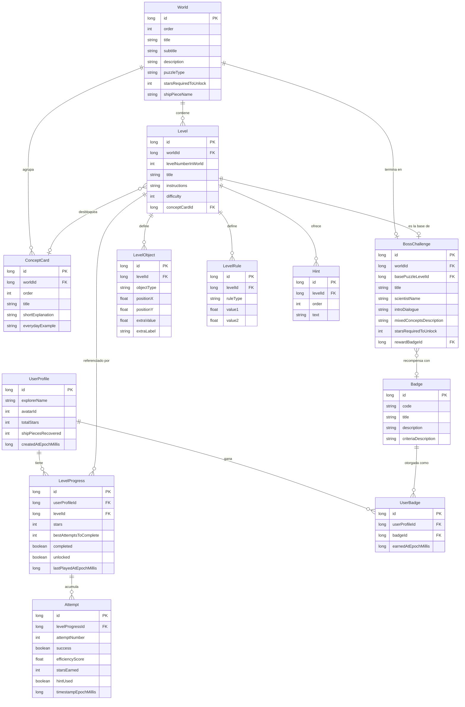

# Esquema de la base de datos — Física Quest

Base de datos local **Room** (SQLite), 100% offline, sin ninguna
sincronización remota. Versión de esquema: 1.

## Diagrama entidad-relación

## Descripción de las tablas

| Tabla | Propósito |
|-------|-----------|
| `user_profile` | Perfil único y local del explorador/a. Sin login. |
| `world` | Los 5 mundos, su tipo de puzzle y el umbral de estrellas para desbloquearse. |
| `level` | Los 30 niveles (6 por mundo, el 6º es el jefe científico). |
| `level_object` | Los elementos físicos/visuales de cada nivel (pelota, meta, obstáculo, carga, rampa, tramo de pista, altavoz, etc.), en coordenadas normalizadas 0f..1f. |
| `level_rule` | Los parámetros de evaluación de cada nivel (tolerancias, umbrales, rangos). |
| `level_progress` | El mejor resultado histórico del jugador en cada nivel (nunca se guarda un resultado peor que el actual). |
| `attempt` | Historial completo de cada intento (éxito/fallo, eficiencia, si se usó pista), útil para el desbloqueo de pistas y estadísticas. |
| `hint` | Los textos de pista de cada nivel, en orden. |
| `concept_card` | Las 25 tarjetas de concepto (5 por mundo). |
| `boss_challenge` | Los 5 desafíos de jefe científico, uno por mundo. |
| `badge` | Las 8 insignias coleccionables. |
| `user_badge` | Relación N:M entre el perfil y las insignias que ganó. |

Ver el SQL equivalente en [`sql/schema.sql`](sql/schema.sql).
